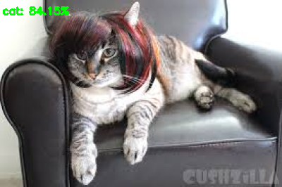

# cat-dog-classifier
A Fine tuned VGG-16 model on catvsdog dataset that is available on kaggle.com.
Clone the repo to train the model on your own.
Follow the file structure as:
``` 
    .
    ├── dataset
    │   ├── train
    │   │   ├── cat 
    │   │   └── dog 
    │   └── val
    │       ├── cat 
    │       └── dog 
    ├── deepmanupy
    │   ├── __pycache__
    │   │   └── config.cpython-36.pyc
    │   └── config.py
    ├── dogs-vs-cats
    │   ├── test 
    │   └── train 
    ├── output
    ├── build_dataset.py
    ├── gpu_config.py
    ├── predict.py
    └── train.py
```
Use the build_dataset.py file to re-arrange the images in `dogs-vs-cats` into corresponding splits in `dataset` directory.

This method is called **Transfer Learning**.


Picture credit : https://www.pyimagesearch.com/2019/06/03/fine-tuning-with-keras-and-deep-learning.

Acheived F-1 score of **97.54%**.

SOTA results on kaggle leaderboard : 98.91%.

A test Image,


